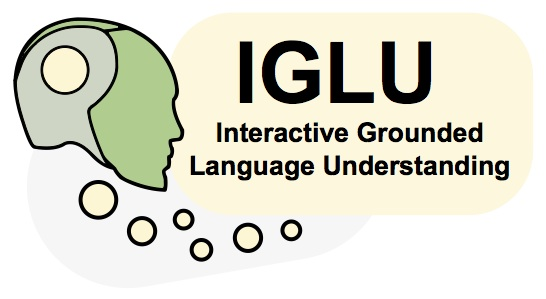
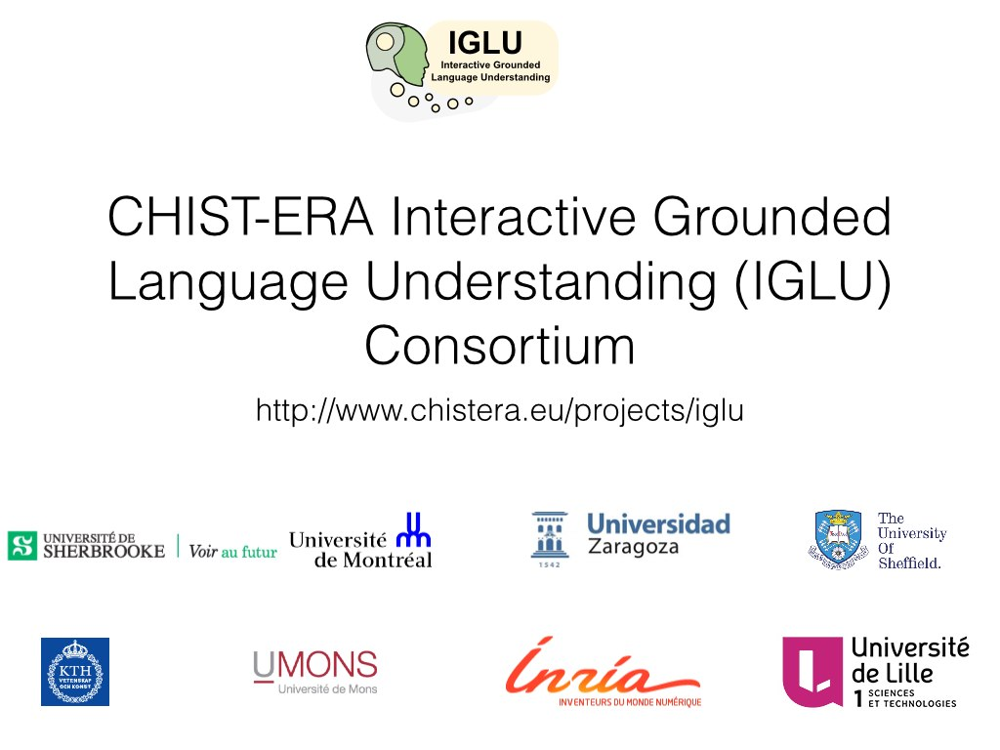

<!-- <a href="http://www.chistera.eu/projects/iglu" target="_blank"> -->
<!-- </a> -->

# Menu

1. [Objectives](#objectives)
2. [Past events under the sponsorship of IGLU](#past-events-under-the-sponsorship-of-iglu)
3. [Public Open Access Datasets, Software and Demonstrations](#public-open-access-datasets-software-and-demonstrations)
 - [Databases](#databases)
 - [Software](#software)
 - [Demonstrations and Applications](#demonstrations-and-applications)
4. [Partners inside IGLU and list of institutional partners](#partners-inside-iglu-and-list-of-institutional-partners) 
5. [Contributors](#contributors)
 - [Experts](#experts)
 - [Students](#students)
6. [Publications](#publications)
 - [2019](#2019)
 - [2018](#2018)
 - [2017](#2017)
 - [2016](#2016)
7. [Media](#media)

# Objectives

Interactive Grounded Language Understanding is an ability that develops in young children through joint interaction with their caretakers and their physical environment. At this level, human language understanding could be referred as interpreting and expressing semantic concepts (e.g. objects, actions and relations) through what can be perceived (or inferred) from current context in the environment. Previous work in the field of artificial intelligence has failed to address the acquisition of such perceptually-grounded knowledge in virtual agents (avatars), mainly because of the lack of physical embodiment (ability to interact physically) and dialogue, communication skills (ability to interact verbally). We believe that robotic agents are more appropriate for this task, and that interaction is a so important aspect of human language learning and understanding that pragmatic knowledge (identifying or conveying intention) must be present to complement semantic knowledge. Through a developmental approach where knowledge grows in complexity while driven by multimodal experience and language interaction with a human, we propose an agent that will incorporate models of dialogues, human emotions and intentions as part of its decision-making process. This will lead anticipation and reaction not only based on its internal state (own goal and intention, perception of the environment), but also on the perceived state and intention of the human interactant. This will be possible through the development of advanced machine learning methods (combining developmental, deep and reinforcement learning) to handle large-scale multimodal inputs, besides leveraging state-of-the-art technological components involved in a language-based dialog system available within the consortium. Evaluations of learned skills and knowledge will be performed using an integrated architecture in a culinary use-case, and novel databases enabling research in grounded human language understanding will be released. IGLU will gather an interdisciplinary consortium composed of committed and experienced researchers in machine learning, neurosciences and cognitive sciences, developmental robotics, speech and language technologies, and multimodal/multimedia signal processing. We expect to have key impacts in the development of more interactive and adaptable systems sharing our environment in everyday life.

IGLU is part of the European CHIST-ERA network (http://www.chistera.eu/projects/iglu) .  
The coordinator is prof. J. Rouat, NECOTIS, Université de Sherbrooke, Québec, Canada, 
 <A HREF="https://www.gel.usherbrooke.ca/rouat/">  https://www.gel.usherbrooke.ca/rouat/</A>.

[[Back to menu]](#menu)

# Past events under the sponsorship of IGLU
<A HREF="https://nips2018vigil.github.io/"> Second Visually-Grounded Interaction and Language (ViGIL), NIPS 2018 Workshop, Montreal, December 2018 

<A HREF="https://chistera-hlu.sciencesconf.org"> First Master Class on Human Language Understanding in the framework of the CHIST-ERA HLU call </A>, Paris, April 10-11th, 2018  
Shared sponsorship with CHIST-ERA, M2CR, ReGROUND, ATLANTIS.

<A HREF="https://nips2017vigil.github.io/"> First Visually-Grounded Interaction and Language (ViGIL), NIPS 2017 Workshop
</A>, Long Beach, California, USA, Friday, December 8th, 2017  
Shared sponsorship with facebook research and google DeepMind.

<A HREF="http://www.speech.kth.se/glu2017/">First International Workshop on Grounding Language Understanding, Satellite of Interspeech 2017
</A>, KTH Royal Institute of Technology, Stockholm, Sweden, Friday, August 25th, 2017  
Shared sponsorship with ISCA.

[[Back to menu]](#menu)

# Partners inside IGLU and list of institutional partners

 
<A HREF="LogosDesInstitution.jpg">List of institutional partners</A>

Partnership with
<a href="https://devine.gel.usherbrooke.ca/" target="_blank"> DEVINE </a> for a final integration on a humanoid robot.

[[Back to menu]](#menu)

# Public Open Access Datasets, Software and Demonstrations

### Databases

We recorded 3 databases that cover 3 levels of knowledge types and
representations giving a gradation in semantic representation and levels of
 interactions and grounding: 
A first one for environment representation and learning for a mobile platform
 (<A HREF="https://ieee-dataport.org/open-access/create-multimodal-dataset-unsupervised-learning-and-generative-modeling-sensory-data"> ROS Create
database</A>, <A HREF="https://arxiv.org/abs/1801.10214"> Documentation on arXiv </A>); 
A second one for object learning and representation on a Baxter platform (<A HREF="http://robots.unizar.es/IGLUdataset/">Multimodal Human-Robot Interaction (MHRI) database</A>);  
A third one for dialogue and a richer semantic with the new GuessWhat game  (<A HREF="https://guesswhat.ai/">The GuessWhat?! database</A>).

### Software

<A HREF="https://home-platform.github.io"> HoME, a Household Multimodal Environment </A>, has been designed to enable artificial agents to learn as humans do, in an interactive, multimodal, and richly contextualized setting. It provides support for vision, audio, semantics, physics and interaction with objects and other agents inside a 3D environment. It can integrate  the 45,000 diverse 3D house layouts based on the large-scale <A HREF="http://suncg.cs.princeton.edu"> SUNCG dataset </A>.

<A HREF="https://github.com/seanwood/gcc-nmf"> Real-time GCC-NMF Blind Speech Separation and Enhancement </A> is a software that eases the audio interaction through the separation and enhancement of sound sources.

### Demonstrations and Applications

Incremental Object Learning with few data on a Baxter robot:  <A HREF="https://www.youtube.com/watch?v=V_72tyBK8Go"> Demonstration on a Baxter Robot </A> (by <A HREF="https://sites.google.com/a/unizar.es/iglu_mhri/home"> UNIZAR</A>).

Cooperative Visually Grounded Dialogue Game with a Humanoid robot, <A HREF="https://nips.cc/Conferences/2018/Schedule?showEvent=12165"> a NIPS 2018 Demonstration </A> (Partnership with <A HREF="https://devine.gel.usherbrooke.ca/"> DEVINE </A>).

[[Back to menu]](#menu)

# Contributors

The IGLU consortium is composed of 8 research teams, across 6 different
countries. The project is a total effort of 325 person-months (PM).

## Experts

- Deep learning & machine learning - **A. Courville** (MILA, UdeM), https://mila.umontreal.ca/
- Reinforcement learning - **O. Pietquin, B. Piot** (CRIStAL, Lille1 & DeepMind), http://www.univ-lille1.fr/
- Neurosciences and cognitive sciences - **J. Rouat** (NECOTIS, UdeS & UdeM), https://www.gel.usherbrooke.ca/necotis/, **R.K. Moore** (U. Sheffield)
- Robotics - **P.Y. Oudeyer** (INRIA), **A.C. Murillo** (UNIZAR), **J. Civera** (UNIZAR)
- Signal Processing (auditory, vision) and machine learning - **J. Rouat** (UdeS & UdeM), **S. Dupont** (U. Mons), **G. Salvi** (KTH)
- Human-Machine interaction - **S. Dupont** (U. Mons)

## Students
11 PhD & 3 Msc.A

[[Back to menu]](#menu)

# Publications

### 2019

- Zhang, C.; Öztireli, C.; Mandt, S.; Salvi, G., **Active Mini-Batch Sampling using Repulsive Point Processes**, The AAAI Conference on Artificial Intelligence, 2019. [arxiv](https://arxiv.org/abs/1804.02772)

### 2018
- Celotti, L.; Brodeur, S.; Rouat, J.,**Language coverage and generalization in RNN-based continuous sentence embeddings for interacting agents**, ViGiL NeurIPS workshop, 2018 <A HREF="https://nips2018vigil.github.io/static/papers/accepted/3.pdf"> [**pdf**]  </A>

- Abdelnour, J.; Salvi, G.; Rouat, J.; Civera J.,**CLEAR: A Dataset for Compositional Language and Elementary Acoustic Reasoning**, ViGiL NeurIPS workshop, 2018 <A HREF="https://nips2018vigil.github.io/static/papers/accepted/16.pdf"> [**pdf**]  </A>

- Azagra, P.; Murillo A.C.; Lopes M.; Civera J.,**Incremental Object Model Learning from Multimodal Human-Robot Interactions**, ViGiL NeurIPS workshop, 2018 <A HREF="https://nips2018vigil.github.io/static/papers/accepted/45.pdf"> [**pdf**]  </A>

- Delbrouck, J.B.; Dupont, S., **Object-oriented Targets for Visual Navigation using Rich Semantic Representations**, ViGiL NeurIPS workshop, 2018 <A HREF="https://nips2018vigil.github.io/static/papers/accepted/15.pdf"> [**pdf**]  </A>

- Delbrouck, J.B.; Dupont, S., **Umons submission for wmt18 multimodal translation task**. In Proceedings of the Third Conference on Machine Translation, Brussels, Belgium. Association for Computational Linguistics, 2018 <A HREF="http://www.statmt.org/wmt18/WMT-2018.pdf#page=673"> [**pdf**]  </A>

- Brodeur, S.; Perez, E.; Anand, A.; Golemo, F.; Celotti, L.; Strub, F.; Rouat, J.; Larochelle, H. & Courville, A., **HoME: a Household Multimodal Environment**, ICLR 2018 Workshop Track, 6th International Conference on Learning Representations, 2018

- Brodeur, S.; Carrier, S.; Rouat, J., **CREATE: Multimodal Dataset for Unsupervised Learning and Generative Modeling of Sensory Data from a Mobile Robot**, IEEE Dataport, 10.21227/H2M94J, 2018

- Brodeur, S.; Carrier, S.; Rouat, J., **CREATE: Multimodal Dataset for Unsupervised Learning, Generative Modeling and Prediction of Sensory Data from a Mobile Robot in Indoor Environments**, CoRR, arXiv:1801.10214v1 [cs.RO], 2018

- K. Stefanov, J. Beskow, G. Salvi, **Self-Supervised Vision-Based Detection of the Active Speaker as a Prerequisite for Socially-Aware Language Acquisition**, submitted to IEEE Transactions on Cognitive and Developmental Systems.

- G. Saponaro, L. Jamone, A. Bernardino, G. Salvi, **Beyond the Self: Using Grounded Affordances to Interpret and Describe Others' Actions**, accepted in IEEE Transactions on Cognitive and Developmental Systems.

- E. Perez, F. Strub, H. Vries, V. Dumoulin, A. Courville **FiLM: Visual Reasoning with a General Conditioning Layer.** arXiv preprint arXiv:1709.07871. Under submission at Association for the Advancement of Artificial Intelligence 2018 (AAAI 2018)

### 2017
- Delbrouck, J.B.; Dupont, S., **Modulating and attending the source image during encoding improves Multimodal Translation**, ViGiL NeurIPS workshop, 2018

- Brodeur, S.; Perez, E.; Anand, A.; Golemo, F.; Celotti, L.; Strub, F.; Rouat, J.; Larochelle, H. & Courville, A. **HoME: a Household Multimodal Environment**, NIPS 2017's Visually-Grounded Interaction and Language Workshop, 2017

- Pablo Azagra, Florian Golemo, Yoan Mollard, Ana Cristina Murillo and Javier Civera, **A Multimodal Dataset for Object Model Learning from Natural Human-Robot Interaction**, 2017 IEEE/RSJ International Conference on Intelligent Robots and Systems (IROS), Vancouver, BC, 2017, pp. 6134-6141. <A HREF="http://webdiis.unizar.es/~jcivera/papers/azagra_etal_iros17.pdf"> [**pdf**]  </A>

- Pablo Azagra, Javier Civera, and Ana C. Murillo. **Finding Regions of Interest from Multimodal Human-Robot Interactions**, Proc. GLU 2017 International Workshop on Grounding Language Understanding. 2017. <A HREF="http://www.speech.kth.se/glu2017/papers/GLU2017_paper_17.pdf"> [**pdf**]  </A>

- Julien Pérolat, Florian Strub, Bilal Piot, Olivier Pietquin, **Learning Nash Equilibrium for General-Sum Markov Games from Batch Data**. arXiv preprint arXiv:1606.08718, Accepted at the International Conference on Artificial Intelligence and Statistics 2017 (AIStat 2017)

- Brodeur, S. & Rouat, J., **Optimality of Inference in Hierarchical Coding for Distributed Object-Based Representations**, 15th. IEEE Canadian Workshop on Information Theory (CIWT), DOI:10.1109/CWIT.2017.7994828, <A HREF="https://www.gel.usherbrooke.ca/rouat/publications/CWIT2017_IEEE_BrodeurRouat.pdf"> [**pdf**]  </A>

- Harm de Vries, Florian Strub, Sarath Chandar, Olivier Pietquin, Hugo Larochelle, Aaron Courville, **GuessWhat?! Visual object discovery through multi-modal dialogue**. arXiv preprint arXiv:1611.08481, Accepted at the Conference on Computer Vision and Pattern recognition  2017 (CVPR 2017) - Spotlight

- Wood, S.U.; Rouat, J.; Dupont, S. & Pironkov, **Blind Speech Separation and Enhancement with GCC-NMF**. IEEE Transactions on Audio, Speech and Language Processing, pp. 3329-3341, 2017, DOI:10.1109/TASLP.2017.2656805, <A HREF="https://www.gel.usherbrooke.ca/rouat/publications/IEEE_ACMTrGCCNMFWoodRouat2017.pdf"> [**pdf**]  </A>

- S. U. N. Wood and J. Rouat, **Real-time speech enhancement with GCC- NMF**. Proc. Interspeech 2017, 2665-2669, DOI: 10.21437/Interspeech.2017-1458.

- S. U. N. Wood and J. Rouat, **Real-time speech enhancement with GCC-NMF: Demonstration on the Raspberry Pi and NVIDIA Jetson**. Proc. Interspeech 2017, 2048-2049, <A HREF="http://www.isca-speech.org/archive/Interspeech_2017/pdfs/2039.PDF"> [**pdf**]  </A>

- S. U. N. Wood and J. Rouat, **Towards GCC-NMF speech enhancement for hearing assistive devices: Reducing latency with asymmetric windows** 1st Int. Conference on Challenges in Hearing Assistive Technology (CHAT-17), Stockholm, Sweden, August 19, 2017, <A HREF="http://spandh.dcs.shef.ac.uk/chat2017/papers/CHAT_2017_wood.pdf"> [**pdf**]  </A>

- F. Strub, H. de Vries, J. Mary, B. Piot, A. Courville, O. Pietquin, **End-to-end optimization of goal-driven and visually grounded dialogue systems.**. arXiv preprint arXiv:1703.05423, Accepted at the International Joint Conference in Artificial Intelligence 2017 (IJCAI 2017) - Oral presentation.

- Kumar Dhaka, A., Salvi, G., **Sparse Autoencoder Based Semi-Supervised Learning for Phone Classification with Limited Annotations**, Proc. GLU 2017 International Workshop on Grounding Language Understanding, Stockholm, Sweden, 22-26, [DOI: 10.21437/GLU.2017-5](http://www.isca-speech.org/archive/GLU_2017/abstracts/GLU2017_paper_5.html).

- Fahlström Myrman, A., Salvi. G., **Partitioning of Posteriorgrams Using Siamese Models for Unsupervised Acoustic Modelling**, Proc. GLU 2017 International Workshop on Grounding Language Understanding, Stockholm, Sweden, 27-31, [DOI: 10.21437/GLU.2017-6](http://www.isca-speech.org/archive/GLU_2017/abstracts/GLU2017_paper_6.html).

- Delbrouck, J., Dupont, S., Seddati, O., **Visually Grounded Word Embeddings and Richer Visual Features for Improving Multimodal Neural Machine Translation**. Proc. GLU 2017 International Workshop on Grounding Language Understanding, 62-67, [DOI: 10.21437/GLU.2017-13](http://www.isca-speech.org/archive/GLU_2017/pdfs/GLU2017_paper_15.pdf)

- Stefanov, K., Beskow, J., Salvi, G., **Vision-based Active Speaker Detection in Multiparty Interaction**, Proc. GLU 2017 International Workshop on Grounding Language Understanding, Stockholm, Sweden, 47-51, [DOI: 10.21437/GLU.2017-10](http://www.isca-speech.org/archive/GLU_2017/abstracts/GLU2017_paper_11.html).

- Saponaro, G., Jamone, L., Bernardino, A., Salvi, G., **Interactive Robot Learning of Gestures, Language and Affordances**, Proc. GLU 2017 International Workshop on Grounding Language Understanding, Stockholm, Sweden, 83-87, [DOI: 10.21437/GLU.2017-17](http://www.isca-speech.org/archive/GLU_2017/abstracts/GLU2017_paper_20.html).

- Brodeur, S., Celotti, L., Rouat, J., **Proposal of a Generative Model of Event-based Representations for Grounded Language Understanding**, Proc. GLU 2017 International Workshop on Grounding Language Understanding, Stockholm, Sweden, 68-72, DOI: 10.21437/GLU.2017-14.

- Delbrouck, J., Dupont, S., **An empirical study on the effectiveness of images in Multimodal Neural Machine Translation**, Proceedings of the 2017 Conference on Empirical Methods in Natural Language Processing 

- H. de Vries , F. Strub , J. Mary, H. Larochelle, O. Pietquin, A. Courville, **Modulating Early visual Processing by language.** arXiv preprint arXiv:1707.00683, Accepted at the Conference on Neural Information Processing System 2017 (NIPS 2017) - Spotlight

- Delbrouck, J., Dupont, S., **Multimodal Compact Bilinear Pooling for Multimodal Neural Machine Translation**, arXiv preprint arXiv:1707.03017

- E. Perez, H. Vries, F. Strub, V. Dumoulin, A. Courville, **Learning Visual Reasoning Without Strong Priors.** arXiv preprint arXiv:1707.03017, Accepted at ICML Speech and Language Processing Workshop 2017.

### 2016

- Pablo, A., Mollard, Y., Golemo, F., Murillo, A. C., Lopes, M., & Civera, J. (2016, December). **A Multimodal Human-Robot Interaction Dataset**. In Future of Interactive Learning Machines Workshop, NIPS 2016. Barcelona, Spain. December 2016, http://www.filmnips.com/accepted-papers/,<A HREF="http://www.filmnips.com/wp-content/uploads/2016/11/FILM-NIPS2016_paper_7.pdf"> [**pdf**] </A>

- Cambra, A. B., Muñoz, A., Guerrero, J. J., & Murillo, A. C. **Dense Labeling with User Interaction: An Example for Depth-Of-Field Simulation**. British Machine Vision Conference (BMVC), 2016.

[[Back to menu]](#menu)

## Media

- 5 March 2018, <A HREF="https://www.usherbrooke.ca/genie/accueil/nouvelles/nouvelles-details/article/36916/"> article in "Les nouvelles" </A>, a French publication from Université de Sherbrooke

- 12 October 2017, <A HREF="http://www.lapresse.ca/techno/201710/12/01-5139764-intelligence-artificielle-ce-qui-mijote-dans-les-labos.php"> article in "La Presse" </A>, a French journal from Montréal 

- October 2017, <A HREF="https://50ans.inria.fr/en/inria-celebrates-its-jubilee/"> French INRIA jubilee </A>, France (in preparation)

[[Back to menu]](#menu)

